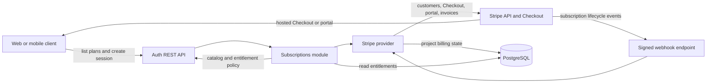
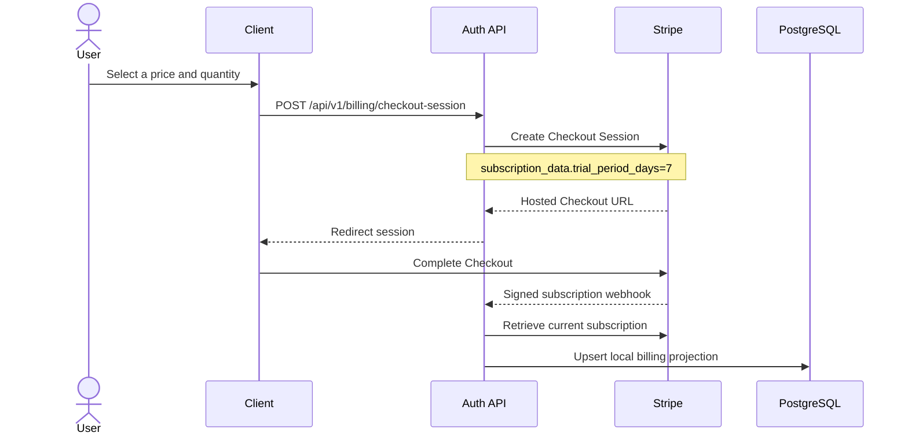

# Stripe subscriber provider

The Stripe provider connects the generic subscription and entitlement layer to
Stripe Billing. Stripe remains the source of truth for customers,
subscriptions, prices, payment state, invoices, and trials. The auth service
stores a local projection so authorization checks do not call Stripe on every
request.

## Architecture



The provider is selected with `provider: "stripe"`. At startup, the
subscriptions module validates the configured catalog against Stripe when the
Stripe API is available. A catalog key is a case-sensitive Stripe Price ID, and
its value describes the local features, quotas, caps, and licences granted by
that price.

The authenticated billing routes are under `/api/v1/billing`. Checkout and
portal mutations require `billing:*:write`; invoice reads require
`billing:*:read`. The Stripe webhook is deliberately outside session
authentication because it authenticates with the `Stripe-Signature` header.

## Checkout and trial flow



Trials are not attached to a Stripe Product or Price. When Checkout is created,
the provider sends `subscription_data[trial_period_days]` to Stripe. The default
is seven days; `"0"` disables it. The current option applies to every new
Checkout subscription in the configured catalog.

## Provision the catalog

Install the [Stripe CLI](https://docs.stripe.com/stripe-cli) and `jq`, then
authenticate against the intended Stripe account and mode:

```bash
stripe login
./contrib/stripe/scripts/provision-default-catalog.sh
```

The script creates or reuses Starter and Growth products and monthly/yearly AED
prices. It also enables price and quantity changes with prorations in the active
default Stripe Customer Portal configuration. It writes
`subscriptions.generated.json`, which contains the resulting case-sensitive
Price IDs but no credentials.

Use a different output file or trial duration when required:

```bash
OUTPUT=subscriptions.qa.json TRIAL_PERIOD_DAYS=7 \
  ./contrib/stripe/scripts/provision-default-catalog.sh
```

Run provisioning separately for Stripe test mode and live mode. Price amounts
are immutable in Stripe. The script reuses active prices by lookup key, so a
changed amount requires a new lookup key or archiving/replacing the old price;
rerunning with only a different amount does not modify an existing price.

## Local configuration

Copy the example and replace the placeholder Price IDs with the IDs generated
for the local Stripe test account:

```bash
cp subscriptions.example.json subscriptions.local.json
```

Point the main application configuration at that file:

```json
{
  "subscriptionsConfigFile": "subscriptions.local.json",
  "extraPermResources": ["billing"]
}
```

Keep credentials out of committed JSON and start the service with test-mode
values:

```bash
export STRIPE_SECRET_KEY='sk_test_...'
export STRIPE_WEBHOOK_SECRET='whsec_...'
go run . --config config.json
```

Forward local Stripe events to the default webhook route:

```bash
stripe listen --forward-to localhost:8000/api/v1/billing/stripe/webhook
```

Use the `whsec_...` value printed by `stripe listen` as
`STRIPE_WEBHOOK_SECRET` for that local process.

## Configuration model

The complete subscription object has this shape:

```json
{
  "enabled": true,
  "mode": "enforce",
  "provider": "stripe",
  "options": {
    "trialPeriodDays": "7",
    "allowPromotionCodes": "false",
    "allowQuantityAdjustment": "true",
    "maxQuantity": "999",
    "graceOnPastDue": "true"
  },
  "currencies": {
    "default": "aed",
    "byCountry": {"AE": "aed"}
  },
  "features": {},
  "limits": {},
  "catalog": {
    "price_case_sensitive_id": {
      "name": "Starter",
      "tier": "starter",
      "licensesPerUnit": 1,
      "features": ["cloud_access"]
    }
  }
}
```

Configuration source precedence is:

1. `SUBSCRIPTIONS_CONFIG_JSON`, containing the complete JSON object
2. `subscriptionsConfigFile` or `SUBSCRIPTIONS_CONFIG_FILE`
3. Legacy inline `subscriptions` in the main application config

The selected object replaces lower-priority objects; objects are not merged.
After loading it, `STRIPE_SECRET_KEY`, `STRIPE_WEBHOOK_SECRET`, and the optional
`STRIPE_WEBHOOK_PATH` override provider options. Direct JSON decoding preserves
the exact case of Stripe Price IDs.

Subscription modes are:

| Mode | Behavior |
| --- | --- |
| `disabled` | Provider is not initialized and entitlement checks allow access. |
| `observe` | Checks run and denied decisions are logged but not enforced. |
| `enforce` | Entitlement and licence failures deny the operation. |

Use `observe` for a controlled production rollout before switching to
`enforce`.

## Stripe webhook

Create a Stripe webhook endpoint using the public HTTPS URL:

```text
https://auth.example.com/api/v1/billing/stripe/webhook
```

Subscribe it to these events:

- `checkout.session.completed`
- `customer.subscription.created`
- `customer.subscription.updated`
- `customer.subscription.deleted`

Copy that endpoint's signing secret to `STRIPE_WEBHOOK_SECRET`. Test-mode and
live-mode webhook endpoints have different signing secrets. The endpoint must
receive the original request body through the ingress or reverse proxy so the
signature can be verified. Stripe retries transient non-2xx responses; event
processing is idempotent.

## CI/CD

The repository CI builds and tests the application, and the release workflow
publishes a multi-architecture image to GHCR. It does not provision Stripe or
inject runtime secrets. Treat catalog provisioning and application deployment
as separate operations:

1. Run tests and build the image without Stripe credentials.
2. Provision the test or live Stripe catalog in a protected, manually approved
   job, or provision it once from an operator workstation.
3. Store the generated subscription JSON as environment-specific deployment
   configuration. Do not substitute test Price IDs into production.
4. Store Stripe API and webhook secrets in the deployment platform's secret
   manager.
5. Apply the subscription database migration before starting the new image.
6. Deploy initially with `mode: "observe"`, verify Checkout and webhook
   processing, then promote the same catalog to `mode: "enforce"`.

Do not run catalog provisioning on every pull request or ordinary deployment.
Although it is idempotent for existing lookup keys, catalog changes are a
billing operation and should require environment protection and approval.

For GitHub Actions, use environment-scoped secrets such as
`STRIPE_SECRET_KEY` and `STRIPE_WEBHOOK_SECRET`. Pass them only to the deployment
job that configures the runtime platform; do not bake them into the container
image or upload them as artifacts. `SUBSCRIPTIONS_CONFIG_JSON` may be held as an
environment variable or generated from approved deployment configuration.

## Production environment

The runtime requires these values for Stripe subscriptions:

| Variable | Required | Purpose |
| --- | --- | --- |
| `SUBSCRIPTIONS_CONFIG_JSON` | Yes, recommended | Complete live-mode catalog and policy configuration. |
| `STRIPE_SECRET_KEY` | Yes | Live secret or restricted key used for Stripe API calls. |
| `STRIPE_WEBHOOK_SECRET` | Yes | Signing secret for the production webhook endpoint. |
| `STRIPE_WEBHOOK_PATH` | No | Overrides `/api/v1/billing/stripe/webhook`. |
| `SUBSCRIPTIONS_CONFIG_FILE` | Alternative | Mounted config file when JSON injection is not used. |

`SUBSCRIPTIONS_ENABLED`, `SUBSCRIPTIONS_MODE`, and `SUBSCRIPTIONS_PROVIDER` are
available for simple overrides, but they do not replace the required catalog.
Prefer one complete `SUBSCRIPTIONS_CONFIG_JSON` to avoid a partially configured
deployment.

Production also requires:

- A public HTTPS webhook URL reachable by Stripe
- PostgreSQL with the subscription migration applied
- `billing` in `extraPermResources` so roles can receive billing permissions
- Live-mode Product and Price IDs in the catalog
- A stable webhook signing secret from the live endpoint
- Monitoring for webhook failures and Stripe subscription state changes

Before enabling enforcement, create a real Checkout Session in the intended
Stripe mode, confirm the subscription shows `trialing`, verify the webhook
returns HTTP 200, and confirm the local subscription endpoint reflects the
same status and Price ID.
